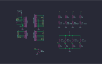

# Projet Simon

Ce projet implémente le célèbre jeu **Simon** sur une plateforme Arduino. Le but du jeu est de reproduire une séquence de LED et de sons générée aléatoirement par le système. À chaque tour, une nouvelle note (LED + son) est ajoutée à la séquence, et le joueur doit répéter la séquence dans le bon ordre en appuyant sur les boutons correspondants. En cas d'erreur, une séquence "Game Over" est jouée et la partie redémarre.

## Matériel nécessaire

- **Arduino Uno** (ou toute autre carte compatible Arduino)
- **4 LEDs** (par exemple : rouge, vert, bleu, jaune)
- **4 Boutons-poussoirs (BP)**
- **1 Buzzer** (pour la sortie sonore)
- **Résistances** (pour les LEDs et éventuellement pour les boutons selon votre montage)
- **Câbles de connexion** et une **breadboard**

## Schéma de connexion

Les broches utilisées dans ce projet sont définies dans le code :

- **LEDs :**
  - LED1 : Broche 2
  - LED2 : Broche 3
  - LED3 : Broche 4
  - LED4 : Broche 5

- **Boutons :**
  - BP1 : Broche 6
  - BP2 : Broche 7
  - BP3 : Broche 8
  - BP4 : Broche 9

- **Buzzer :**
  - BUZZ : Broche 10

> **Note :** Assurez-vous de connecter les composants correctement et d'utiliser des résistances adaptées pour protéger les LEDs et les boutons.

## Description du code

Le code se divise en plusieurs fonctions :

- **setup()**  
  Configure les broches en mode `INPUT` ou `OUTPUT` et initialise la communication série.

- **Ajouter_Note()**  
  Ajoute une nouvelle note aléatoire à la séquence `melody`.

- **Simon_Play()**  
  Parcourt la séquence `melody` et joue la note correspondante en allumant la LED associée et en jouant un son via le buzzer.

- **Scan_Boutons() & Bouton_Test()**  
  Ces fonctions gèrent la détection des appuis sur les boutons. Chaque bouton est lié à une LED et à une tonalité spécifique.

- **GameOver()**  
  Joue une séquence de fin pour signaler que le joueur a fait une erreur dans la saisie de la séquence.

- **loop()**  
  La boucle principale du jeu qui :
  1. Ajoute une nouvelle note à la séquence.
  2. Joue la séquence complète.
  3. Attend que le joueur reproduise la séquence en scannant les boutons.  
     En cas d'erreur, la séquence Game Over est déclenchée et la partie redémarre.

## Comment utiliser le projet

1. **Branchement :**  
   Réalisez le montage en connectant les LEDs, boutons et buzzer aux broches indiquées. Vérifiez que tous les composants sont bien alimentés et que les connexions sont sécurisées.

2. **Téléversement du code :**  
   - Ouvrez l’IDE Arduino.
   - Copiez le code source dans un nouveau sketch.
   - Sélectionnez le bon modèle d’Arduino et le port série correspondant.
   - Téléversez le sketch sur la carte Arduino.

3. **Lancement du jeu :**  
   Une fois le programme téléversé, la carte Arduino démarre automatiquement le jeu.
   - La séquence commence par l'ajout d'une note aléatoire.
   - La séquence est affichée via les LEDs et le buzzer.
   - Appuyez sur les boutons correspondants pour reproduire la séquence.  
     *Exemple :* Si la LED1 s’allume, appuyez sur le bouton BP1.
   - Si la séquence est correctement reproduite, une nouvelle note est ajoutée et le jeu continue.
   - En cas d'erreur, le signal Game Over est joué, et la séquence redémarre.

4. **Observation via le moniteur série :**  
   Le moniteur série affiche certaines informations (comme les tonalités jouées ou le message "Game Over"). Pour l’ouvrir, cliquez sur **Outils > Moniteur Série** dans l’IDE Arduino.

## Personnalisation

- **Modifier les tonalités :**  
  Les tonalités sont définies dans le tableau `son[]`. Vous pouvez modifier ces valeurs pour changer les sons émis par le buzzer.

- **Modifier la vitesse du jeu :**  
  Ajustez les délais (`delay()`) dans les fonctions `Simon_Play()`, `Bouton_Test()`, et `GameOver()` pour rendre le jeu plus rapide ou plus lent.

## Remarques

- **Débounce des boutons :**  
  Un délai de 20 ms est utilisé dans la fonction `Bouton_Test()` pour éviter les rebonds (détection multiple d’un même appui). Selon votre montage, vous pourriez avoir besoin d'ajuster cette valeur.

- **Extensibilité :**  
  Vous pouvez étendre ce projet en ajoutant d'autres fonctionnalités comme un affichage sur écran LCD, une gestion des scores, ou encore une difficulté progressive.

## Conclusion

Ce projet Simon est un excellent moyen de se familiariser avec la programmation sur Arduino, la gestion des entrées/sorties et la création d'interfaces interactives simples. Amusez-vous bien et n'hésitez pas à expérimenter pour l'améliorer ou le personnaliser !

---

*Date de création : 03/02/2025*
